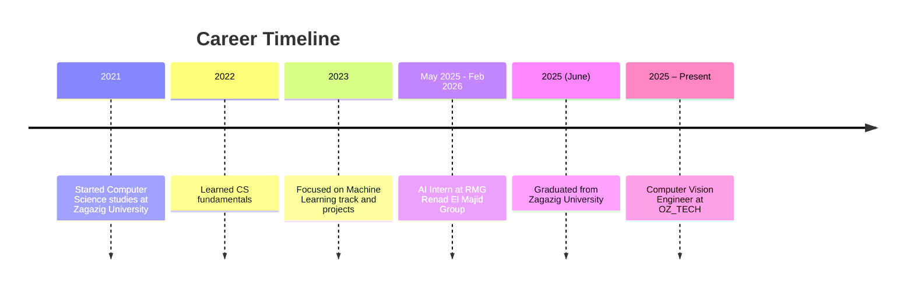

# Mohamed Ehab

**AI Engineer | Computer Vision & Machine Learning Specialist**

---

<!-- Banner Divider -->

  

---

## About Me

> Computer Science graduate – Artificial Intelligence track, Zagazig University  
> Experienced in building and deploying AI models to solve real-life challenges  
> Developed solutions in computer vision (image/video analysis, OCR) and natural language processing  
> Always learning new AI, ML, and Deep Learning techniques  
> Interested in data analysis, production deployment, coding challenges, and scientific research

---

<!-- Badges for Skills -->
## Technical Skills

  
  
  
  
  
  
  
  

---

## Achievements & Timeline

---

## Featured Projects

- 🚗 [Smart Parking System](https://github.com/mohamed-ehab415/Smart_Parking): An integrated smart parking management system using computer vision and AI.
- 🛡️ [Credit Card Fraud Detection](https://github.com/mohamed-ehab415/Credit-Card-Fraud-Detection-): Building ML models to detect fraudulent transactions.
- 📚 [DSA Homework & Practice](https://github.com/mohamed-ehab415/DSA_HOMEWORK): Practical exercises in data structures and algorithms using Python and C++.
- 🌱 [Suger Beets Project](https://github.com/mohamed-ehab415/suger_beets): AI-powered project for sugar beet analysis and solutions.

---

> “AI is not just about technology; it’s about solving real problems and making a difference.”

---

## GitHub Statistics & Activity

  

  

  

  

  
  

---

## Contact Me

  
  

---

  

 
